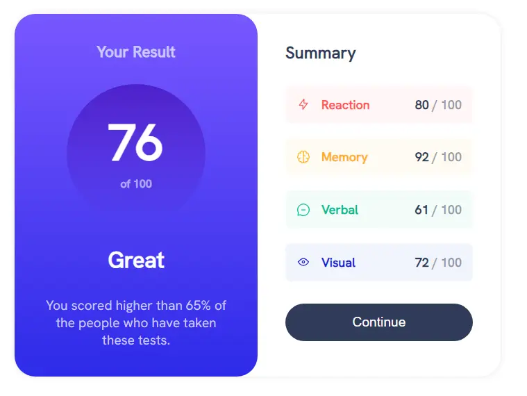
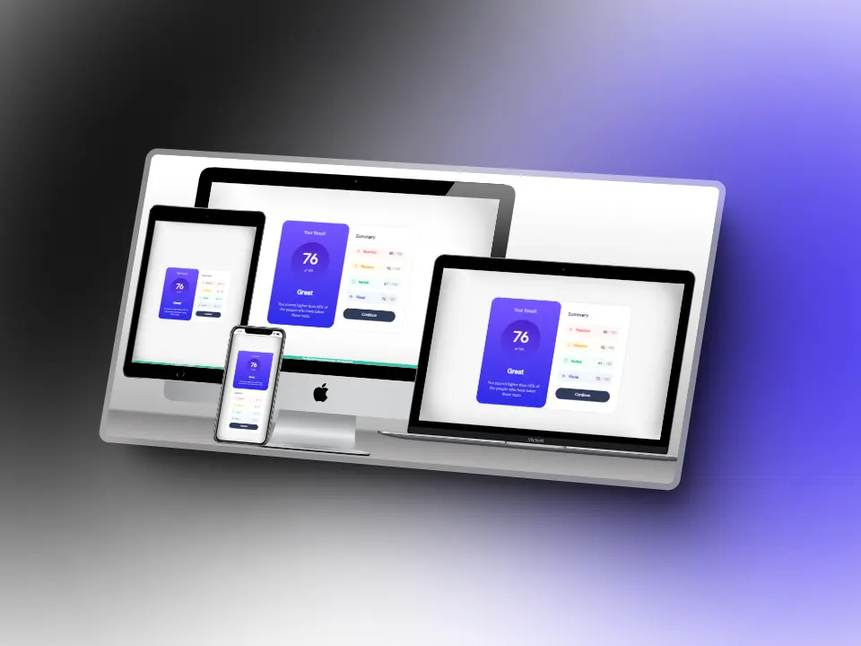

<div align="center" style="text-align: center">

  <h1><b>PROY06: Results Summary Component<b></h1>
</div>

[PROY06: Results Summary Component] construido con `HTML`, `CSS` y `JavaScript` para mejorar nuestras habilidades de codificación. Este proyecto es el sexto de los desafios #100daysofprojects promovido por [Frontend Club](https://www.facebook.com/frontendclubfb).



### Tabla de contenidos

- [Descripcion](#descripcion)
  - [El desafio](#el-desafio)
  - [Capturas](#capturas)
  - [Enlaces](#enlaces)
- [Flujo de trabajo](#flujo-de-trabajo)
  - [Desarrollo](#desarrollo)
  - [Recursos](#recursos)
- [Agradecimientos](#agradecimientos)
- [Contacto](#contacto)
- [Licencia](#licencia)

## Descripcion

### El desafio

Crear un componente resumen de resultados, usando `HTML` y `CSS`, y lograr que se parezca lo más posible al diseño.

### Los usuarios deberían poder:

1. Ver el diseño óptimo en pantallas `grandes(1200px)` y `pequeñas(375px)`.
2. Ver un color de fondo `gradiente(hover)` al pasar el mouse sobre el botón.
3. `Bonus`: Muestra los datos en el diseño desde un archivo JSON JavaScript


### Importante:

1. Agrega icono `favicon` al proyecto.
2. Agrega una `URL` fácil de recordar (ej. `06-results-summary-component`).
3. Agrega un `título` al proyecto (ej. `Results Summary Component - Frontend Club`).
4. **Bonus**: Agrega un archivo `README.md` al proyecto.


### Capturas



### Enlaces

- [Proyecto](https://06-results-summary-component-larry.netlify.app/)
- [Repositorio](https://github.com/LarryIVC/100_days_of_projects_day8)

## Flujo de trabajo

### Desarrollo

**Estructura del proyecto**

```txt
/
📂
├── 📂assets/
│ └── 📂fonts/
│   └── HankenGrotesk-VariableFont_wght.ttf
│ └── 📂images/
│   └── favicon-32x32.png
│   └── icon-memory.svg
│   └── icon-reaction.svg
│   └── icon-verbal.svg
│   └── icon-visual.svg
│   └── logo.webp
│   └── mockup.webp
│   └── scrrenshoot.webp
├── 📂css/
│ └── styles.css
├── 📂js/
│ └── index.js
└── index.html
└── LICENSE
└── README.md
```

**Tecnologías**

1. `HTML` Semántico
2. Estilos `CSS`
3. `Git` y `GitHub`
4. `Netlify`
5. `JavaScript`

**Flujo de desarrollo**

1. Análisis del diseño
2. Configuración inicial
   - Vincular archivos y librerías
   - Iniciar proyecto con Git
3. Marcado HTML
   - Estructura semántica
   - Atributos accesibles
   - Enlaces y rutas
4. Estilos CSS
   - De arriba hacia abajo
   - Estilos reutilizables
   - Estilos personalizados
5. Flujo de trabajo `mobile-first`

**Fragmentos de codigo**

Etiquetas `meta` para el SEO.

```html
<meta name="author" content="Larry Villegas Costas" />
<meta
  name="title"
  content="PROY06: Results Summary Component - Larry Villegas Costas - Frontend Club"
/>
<meta
  name="description"
  content="PROY06: Results Summary Component - Larry Villegas Costas - Frontend Club"
/>
<title>Results Summary Component - Frontend Club</title>
```

Animaciones CSS.

```css
.summary-container > button:hover {
  background: linear-gradient(var(--light-slate-blue), var(--light-royal-blue));
}
```

JavaScript para cargar datos desde un archivo JSON.

```js
function main() {
  window.addEventListener("load", () => {
    const list = document.getElementById("summary-list")
    let html = ""
    data.forEach((item) => {
      html += `
      <li style="background: ${item.bg};">
      <div class="literal">
        <span style="color: ${item.color};">${item.category}</span>
      </div>
      <div class="numeral">
        <span><strong>${item.score}</strong> </span><span class="light">/ 100</span>
      </div>
    </li>`
    })
    console.log(html)
    list.innerHTML = html
  })
}
```

### Recursos

Comparte los recursos que hayas utilizado para completar este proyecto.

1. [Frontend Club](https://www.facebook.com/frontendclubfb) - Comunidad de desarrollo web
2. [Netlify](https://www.netlify.com/) - Plataforma de alojamiento web
3. [Multi Device Website Mockup Generator](https://techsini.com/multi-mockup/index.php) - Generador de maquetas
4. [SVGOMG](https://jakearchibald.github.io/svgomg/) - Optimizador de SVG
5. [Squoosh](https://squoosh.app/) - Optimizador de imágenes
6. [Shots](https://shots.so/) - Capturas de pantalla
7. [Google Fonts](https://fonts.google.com/) - Fuentes gratuitas

## Agradecimientos

- Mi familia que siempre me apoya en mis proyectos
- Mi streeamer favorito que me inspira a seguir adelante [@midudev](https://www.twitch.tv/midudev)

## Contacto

- [LinkedIn](https://www.linkedin.com/in/larryvillegascostas/)
- [Facebook](https://www.facebook.com/profile.php?id=1201373751)
- [GitHub](https://github.com/LarryIVC)
- [Correo](mailto:larry_villegas@hotmail.com)
- [Twitter](https://twitter.com/LarryVillegas)
- [Portfolio](https://portfolio-larry.netlify.app/)

## Licencia

Este proyecto está bajo la Licencia (MIT) - mira el archivo [LICENSE](LICENSE) para detalles

*No dudes en contactarme si crees que te puedo ayudar en algún proyecto o tienes un trabajo para mi.*

